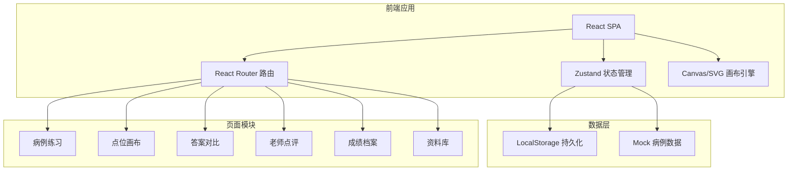
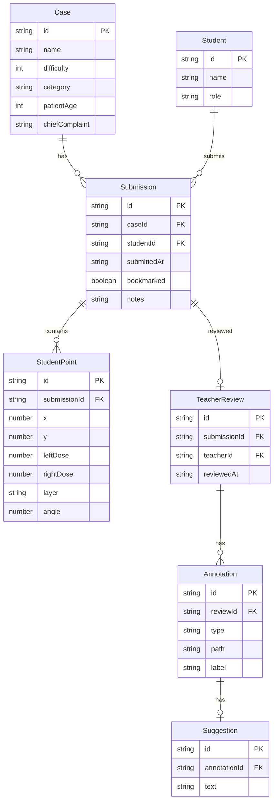

## 1. 架构设计



## 2. 技术说明

- 前端框架：React@18 + TypeScript + Vite
- 样式方案：Tailwind CSS@3
- 状态管理：Zustand（含 persist 中间件持久化到 localStorage）
- 路由：React Router DOM v6
- 画布交互：SVG（面部图和点位标注）+ Canvas（雷达图）
- 图标：lucide-react
- PDF导出：html2canvas + jspdf
- 初始化工具：vite-init
- 后端：无（纯前端，数据存 localStorage）
- 数据库：无（使用 Mock 数据 + localStorage）

## 3. 路由定义

| 路由 | 用途 |
|------|------|
| `/` | 登录/选择身份页 |
| `/cases` | 病例练习页，浏览病例库 |
| `/canvas/:caseId` | 点位画布页，标注点位和填写剂量 |
| `/compare/:submissionId` | 答案对比页，查看差异和写调整理由 |
| `/review/:submissionId` | 老师点评页，圈注和写建议 |
| `/profile` | 成绩档案页，练习历史和结业导出 |
| `/resources` | 资料库页，解剖图集和参考资料 |

## 4. API 定义

无后端 API，所有数据通过 Zustand store + localStorage 管理。

### 核心数据类型

```typescript
interface Case {
  id: string
  name: string
  difficulty: 1 | 2 | 3
  category: string
  patientAge: number
  patientGender: string
  chiefComplaint: string
  injectionHistory: string
  contraindications: string[]
  anatomyHints: string[]
  standardPoints: StandardPoint[]
  dangerZones: DangerZone[]
}

interface StandardPoint {
  id: string
  x: number
  y: number
  side: "left" | "right" | "bilateral"
  dose: number
  layer: "intradermal" | "subcutaneous" | "intramuscular"
  angle: number
  label: string
}

interface DangerZone {
  id: string
  path: string
  name: string
  warning: string
}

interface Submission {
  id: string
  caseId: string
  studentId: string
  studentName: string
  points: StudentPoint[]
  submittedAt: string
  adjustedReasons: AdjustedReason[]
  score?: SubmissionScore
  review?: TeacherReview
  bookmarked: boolean
  notes: string
}

interface StudentPoint {
  id: string
  x: number
  y: number
  side: "left" | "right" | "bilateral"
  leftDose: number
  rightDose: number
  layer: "intradermal" | "subcutaneous" | "intramuscular"
  angle: number
}

interface AdjustedReason {
  pointId: string
  reason: string
}

interface SubmissionScore {
  total: number
  pointAccuracy: number
  doseReasonable: number
  layerCorrect: number
  safetyAwareness: number
}

interface TeacherReview {
  teacherId: string
  teacherName: string
  annotations: Annotation[]
  suggestions: Suggestion[]
  reviewedAt: string
}

interface Annotation {
  id: string
  type: "circle" | "arrow"
  path: string
  label: string
}

interface Suggestion {
  annotationId: string
  text: string
}

interface Student {
  id: string
  name: string
  role: "student" | "teacher"
}
```

## 5. 服务器架构图

无后端服务器，纯前端应用。

## 6. 数据模型

### 6.1 数据模型定义



### 6.2 数据定义

使用 Mock 数据初始化，存储于 localStorage，包含：

- 3个预设模拟病例（咬肌肥大、泪沟填充、眉间纹改善）
- 每个病例含标准点位数据、危险区域数据
- 预设学员和老师账号
